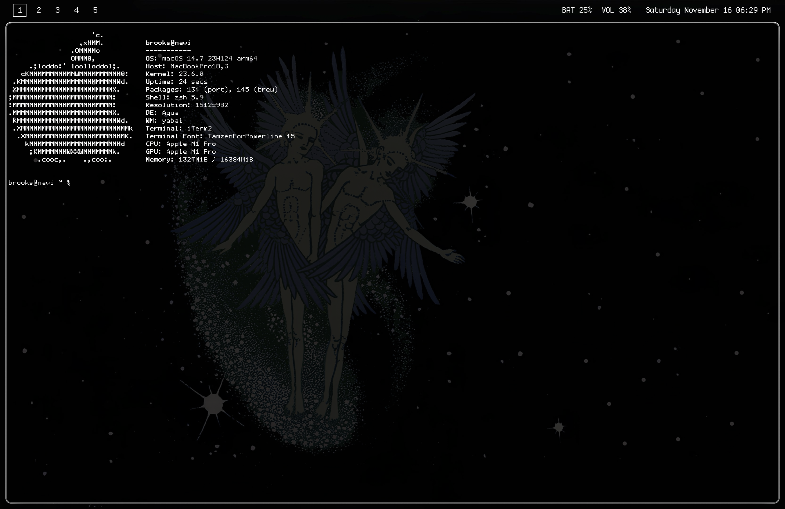

# dotfiles

A collection of my dotfiles for my macOS setup.



## macOS

Having riced Arch Linux before my current MacOS setup, I wanted to try and create something identical and was able to accomplish that with several popular MacOS tweaks to feel more like Linux with the exception of getting my VSCode to be transparent (the plugin doesn't currently work for the latest version of VSCode).

Here is the list of the tweaks I used on my MacBook Pro 14":

- [yabai](https://github.com/koekeishiya/yabai) – A window manager for macOS that provides tiling window management.
- [skhd](https://github.com/koekeishiya/skhd) – A simple hotkey daemon for macOS, used in combination with `yabai` to manage window focus and actions.
- [neofetch](https://github.com/dylanaraps/neofetch) – A fast, customizable system information tool written in Bash.
- [sketchybar](https://github.com/FelixKratz/SketchyBar) – A highly customizable macOS status bar, used to display system information, widgets, and more.
- [jankyborders](https://github.com/FelixKratz/JankyBorders) – A macOS tweak that mimics the border style of Linux window managers.
- [spicetify](https://github.com/spicetify/spicetify-cli) – A command-line tool to customize the appearance of Spotify's desktop app.
- [iTerm2](https://iterm2.com/) – A replacement for the default macOS terminal with features like split panes, support for custom key bindings, and transparency.

### Setup Instructions

You can easily copy my dotfiles into your own configuration folder using the following commands:

1. **Clone this repository** to your machine if you haven't already:

```bash
git clone https://github.com/bjaxqq/dotfiles.git
cd dotfiles
```

2. **Copy the configuration files** into the appropriate directories in your '~/.config' folder:

```bash
# Create directories if they do not exist
mkdir -p ~/.config/yabai ~/.config/skhd ~/.config/neofetch ~/.config/sketchybar/plugins

# Copy yabai configuration
cp borders/bordersrc ~/.config/yabai/bordersrc
cp yabai/yabairc ~/.config/yabai/yabairc

# Copy skhd configuration
cp skhd/skhdrc ~/.config/skhd/skhdrc

# Copy neofetch configuration
cp neofetch/config.conf ~/.config/neofetch/config.conf

# Copy sketchybar plugin scripts
cp sketchybar/plugins/* ~/.config/sketchybar/plugins/

# Copy sketchybar main configuration
cp sketchybar/sketchybarrc ~/.config/sketchybar/sketchybarrc
```

3. **Ensure the plugin scripts are executable** for SketchyBar:

```bash
chmod +x ~/.config/sketchybar/plugins/*
```

4. Restart or reload services for the changes to take effect. For example, restart 'yabai' and 'skhd':

```bash
brew services restart yabai
brew services restart skhd
```
