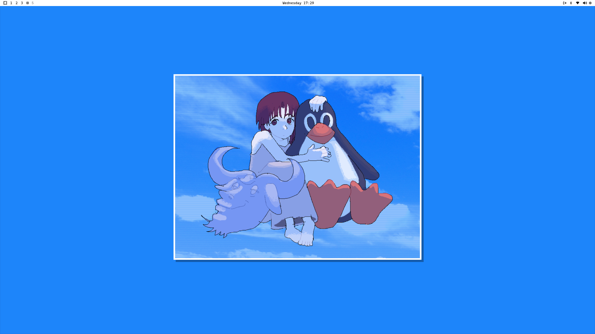

# omarchy

Dotfiles for my Omarchy setup.

## Update: 17-11-2025

This is my current Omarchy (Arch) setup. I didn't change much from the original Omarchy config, just the theming, wallpapers, and some extra tweaks to the default Hyprland settings.



Here is the list of the changes made:

- [Hyprland](https://hyprland.org/) – Changed the resolution/refresh rate to work for my monitor, mouse/keyboard inputs, and keybinds
- [Waybar](https://github.com/Alexays/Waybar) – Changed the font size
- [Spicetify](https://github.com/spicetify/spicetify-cli) – My custom configuration for the Spicetify 'text' theme
- `~/.local/share/applications/Ente.desktop` - A custom desktop file made so I can see the image and name for the Ente Authenticator app in the application launcher 

### Setup Instructions

You can copy my dotfiles into your own configuration folder using the following commands:

1. **Clone this repository** to your machine if you haven’t already:

```bash
git clone https://github.com/bjaxqq/dotfiles.git
cd dotfiles/omarchy
```

2. **Copy configuration files** into your `~/.config` and other appropriate directories:

```bash
# Create necessary directories
mkdir -p ~/.config/hypr ~/.config/waybar ~/.config/spicetify
mkdir -p ~/.local/share/applications

# Copy Hyprland, Waybar, and Spicetify configurations
cp -r .config/hypr/* ~/.config/hypr/
cp -r .config/waybar/* ~/.config/waybar/
cp -r .config/spicetify/* ~/.config/spicetify/

# Copy Ente desktop app (to show in Rofi/other application launcher)
cp .local/share/applications/Ente.desktop ~/.local/share/applications/
```

3. **Optional: Install packages from my lists:**

```bash
# Install AUR packages
yay -S --needed - < packages/aurlist.txt

# Install official repository packages
sudo pacman -S --needed - < packages/pkglist.txt
```

4. Restart your session or reload your compositor and bar for changes to take effect:

```bash
# For Hyprland
hyprctl reload

# For Waybar
pkill waybar && waybar &
```

## Prerequisites

Obviously this is based off of Omarchy, so first make sure that it is the version of Arch Linux installed (if you want to get to this setup easier). Then I use a custom theme called 'snow', which can be found [here](https://github.com/bjarneo/omarchy-snow-theme).